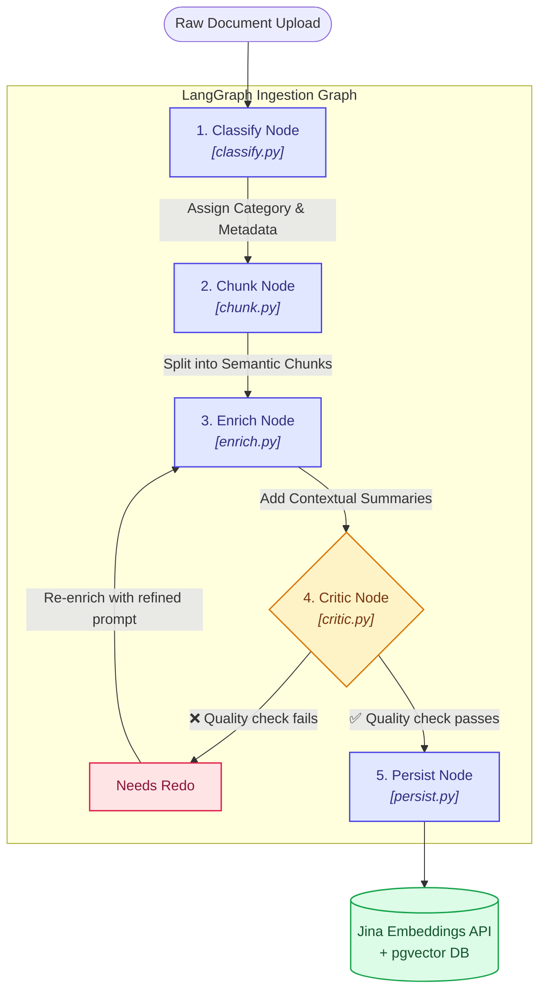
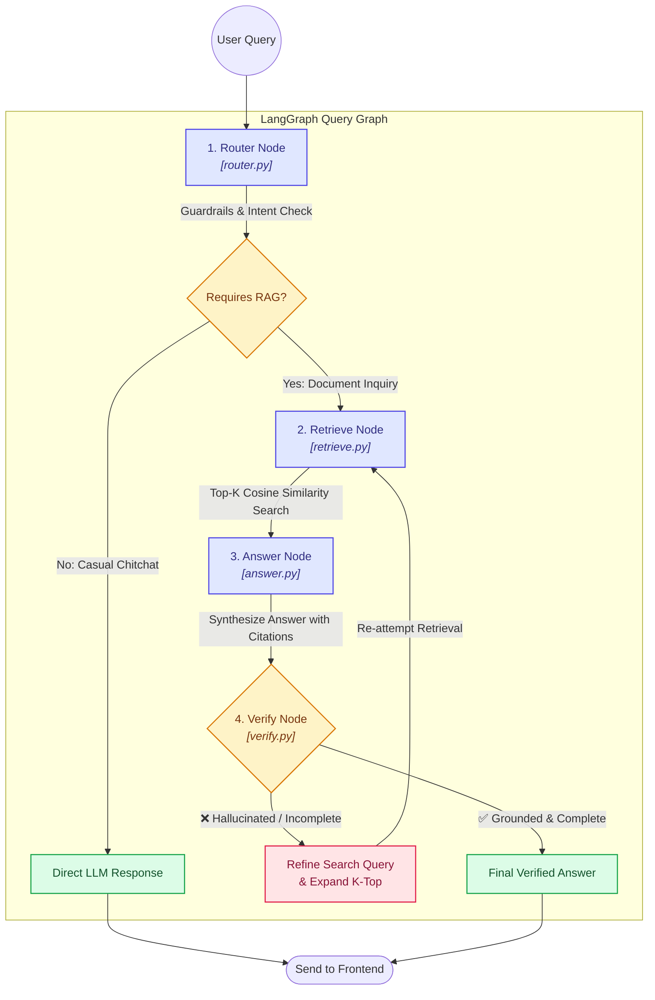

# RAGent

> **Agentic RAG (Retrieval-Augmented Generation) Platform with Multi-Agent Workflows**

RAGent is an end-to-end, production-ready Agentic RAG system. It combines an autonomous document ingestion pipeline with a self-correcting query answering graph, backed by a FastAPI backend, PostgreSQL with `pgvector` vector store, Jina embeddings, Groq LLM, and a modern React frontend.

---

##  System Architecture

The following diagram illustrates the complete workflow and interactions across the React frontend, FastAPI app, multi-agent graphs, PostgreSQL + `pgvector` store, and external APIs.

```mermaid
%% Generated by https://gitdiagram.com/chinmaye5/ragent
flowchart TD

subgraph group_web["Web app"]
  node_app["App routing<br/>[App.jsx]"]
  node_home["Home and accounts<br/>[Home.jsx]"]
  node_chatui["Chat experience<br/>[ChatPage.jsx]"]
  node_chatparts["Chat components<br/>[ChatMessages.jsx]"]
  node_dashboard["Dashboard<br/>[Dashboard.jsx]"]
  node_webapi["API client<br/>[api.js]"]
end

subgraph group_api["API and accounts"]
  node_apiapp["FastAPI app<br/>[main.py]"]
  node_auth["Authentication<br/>[auth.py]"]
  node_chatapi["Chat routes<br/>[chats.py]"]
  node_docapi["Document routes<br/>[documents.py]"]
end

subgraph group_ingest["Document ingestion"]
  node_ingestgraph["Ingestion graph<br/>[ingestion_graph.py]"]
  node_classify["Document classification<br/>[classify.py]"]
  node_chunk["Document chunking<br/>[chunk.py]"]
  node_enrich["Chunk enrichment<br/>[enrich.py]"]
  node_critic["Ingestion review<br/>[critic.py]"]
  node_persist["Chunk persistence<br/>[persist.py]"]
end

subgraph group_query["Question answering"]
  node_querygraph["Query graph<br/>[query_graph.py]"]
  node_router["Query routing<br/>[router.py]"]
  node_retrieve["Chunk retrieval<br/>[retrieve.py]"]
  node_answer["Answer generation<br/>[answer.py]"]
  node_verify["Answer verification<br/>[verify.py]"]
  node_qstate["Query state and LLM<br/>[state.py]"]
end

subgraph group_infra["Shared services"]
  node_db[("Relational and vector DB<br/>[models.py]")]
  node_dbconn["Database connections<br/>[database.py]"]
  node_docservice["Document and model clients"]
  node_gateway["LLM gateway<br/>[gateway.py]"]
  node_guardrails["Query guardrails<br/>[guardrails.py]"]
end

node_visitor(("User"))
node_jina["Jina embeddings API"]
node_groq["Groq model API"]

node_visitor -->|"uses"| node_app
node_app -->|"routes to"| node_home
node_app -->|"routes to"| node_chatui
node_app -->|"routes to"| node_dashboard
node_chatui -->|"renders"| node_chatparts
node_chatui -.->|"calls"| node_webapi
node_home -.->|"calls"| node_webapi
node_dashboard -.->|"calls"| node_webapi
node_webapi -.->|"sends requests"| node_apiapp
node_apiapp -->|"registers"| node_auth
node_apiapp -->|"registers"| node_chatapi
node_apiapp -->|"registers"| node_docapi
node_auth -->|"gets sessions"| node_dbconn
node_auth -->|"queries users"| node_db
node_chatapi -->|"invokes"| node_querygraph
node_chatapi -->|"uses"| node_dbconn
node_chatapi -->|"stores chat data"| node_db
node_docapi -->|"invokes"| node_ingestgraph
node_docapi -->|"invokes"| node_querygraph
node_docapi -->|"uses"| node_db
node_docapi -->|"uses"| node_docservice
node_ingestgraph -.->|"dispatches"| node_classify
node_ingestgraph -.->|"dispatches"| node_chunk
node_ingestgraph -.->|"dispatches"| node_enrich
node_ingestgraph -.->|"dispatches"| node_critic
node_ingestgraph -.->|"dispatches"| node_persist
node_classify -->|"uses"| node_docservice
node_querygraph -->|"dispatches"| node_router
node_querygraph -->|"dispatches"| node_retrieve
node_querygraph -->|"dispatches"| node_answer
node_querygraph -->|"dispatches"| node_verify
node_router -->|"routes RAG"| node_retrieve
node_retrieve -->|"passes chunks"| node_answer
node_answer -->|"passes answer"| node_verify
node_verify -->|"retries"| node_retrieve
node_retrieve -->|"queries through"| node_dbconn
node_retrieve -->|"searches chunks"| node_db
node_retrieve -->|"embeds queries"| node_docservice
node_qstate -->|"gets LLM client"| node_docservice
node_qstate -->|"calls LLM gateway"| node_gateway
node_router -->|"uses"| node_guardrails
node_docservice -->|"requests embeddings"| node_jina
node_gateway -.->|"routes model calls"| node_groq

click node_app "https://github.com/chinmaye5/ragent/blob/main/frontend/src/App.jsx"
click node_home "https://github.com/chinmaye5/ragent/blob/main/frontend/src/pages/Home.jsx"
click node_chatui "https://github.com/chinmaye5/ragent/blob/main/frontend/src/pages/ChatPage.jsx"
click node_chatparts "https://github.com/chinmaye5/ragent/blob/main/frontend/src/components/ChatMessages.jsx"
click node_dashboard "https://github.com/chinmaye5/ragent/blob/main/frontend/src/pages/Dashboard.jsx"
click node_webapi "https://github.com/chinmaye5/ragent/blob/main/frontend/src/api.js"
click node_apiapp "https://github.com/chinmaye5/ragent/blob/main/backend/app/main.py"
click node_auth "https://github.com/chinmaye5/ragent/blob/main/backend/app/api/routes/auth.py"
click node_chatapi "https://github.com/chinmaye5/ragent/blob/main/backend/app/api/routes/chats.py"
click node_docapi "https://github.com/chinmaye5/ragent/blob/main/backend/app/api/routes/documents.py"
click node_ingestgraph "https://github.com/chinmaye5/ragent/blob/main/backend/app/agents/ingestion_graph.py"
click node_classify "https://github.com/chinmaye5/ragent/blob/main/backend/app/agents/nodes/ingestion/classify.py"
click node_chunk "https://github.com/chinmaye5/ragent/blob/main/backend/app/agents/nodes/ingestion/chunk.py"
click node_enrich "https://github.com/chinmaye5/ragent/blob/main/backend/app/agents/nodes/ingestion/enrich.py"
click node_critic "https://github.com/chinmaye5/ragent/blob/main/backend/app/agents/nodes/ingestion/critic.py"
click node_persist "https://github.com/chinmaye5/ragent/blob/main/backend/app/agents/nodes/ingestion/persist.py"
click node_querygraph "https://github.com/chinmaye5/ragent/blob/main/backend/app/agents/query_graph.py"
click node_router "https://github.com/chinmaye5/ragent/blob/main/backend/app/agents/nodes/query/router.py"
click node_retrieve "https://github.com/chinmaye5/ragent/blob/main/backend/app/agents/nodes/query/retrieve.py"
click node_answer "https://github.com/chinmaye5/ragent/blob/main/backend/app/agents/nodes/query/answer.py"
click node_verify "https://github.com/chinmaye5/ragent/blob/main/backend/app/agents/nodes/query/verify.py"
click node_qstate "https://github.com/chinmaye5/ragent/blob/main/backend/app/agents/nodes/query/state.py"
click node_db "https://github.com/chinmaye5/ragent/blob/main/backend/app/models/models.py"
click node_dbconn "https://github.com/chinmaye5/ragent/blob/main/backend/app/core/database.py"
click node_docservice "https://github.com/chinmaye5/ragent/blob/main/backend/app/services/document_service.py"
click node_gateway "https://github.com/chinmaye5/ragent/blob/main/backend/app/core/gateway.py"
click node_guardrails "https://github.com/chinmaye5/ragent/blob/main/backend/app/core/guardrails.py"

classDef toneNeutral fill:#f8fafc,stroke:#334155,stroke-width:1.5px,color:#0f172a
classDef toneBlue fill:#dbeafe,stroke:#2563eb,stroke-width:1.5px,color:#172554
classDef toneAmber fill:#fef3c7,stroke:#d97706,stroke-width:1.5px,color:#78350f
classDef toneMint fill:#dcfce7,stroke:#16a34a,stroke-width:1.5px,color:#14532d
classDef toneRose fill:#ffe4e6,stroke:#e11d48,stroke-width:1.5px,color:#881337
classDef toneIndigo fill:#e0e7ff,stroke:#4f46e5,stroke-width:1.5px,color:#312e81
classDef toneTeal fill:#ccfbf1,stroke:#0f766e,stroke-width:1.5px,color:#134e4a
class node_app,node_home,node_chatui,node_chatparts,node_dashboard,node_webapi,node_visitor toneBlue
class node_apiapp,node_auth,node_chatapi,node_docapi toneAmber
class node_ingestgraph,node_classify,node_chunk,node_enrich,node_critic,node_persist,node_jina,node_groq toneMint
class node_querygraph,node_router,node_retrieve,node_answer,node_verify,node_qstate toneRose
class node_db,node_dbconn,node_docservice,node_gateway,node_guardrails toneIndigo
```



---

##  Detailed Pipeline Workflows

### 1.  Document Ingestion Pipeline

The Ingestion Pipeline executes autonomously upon document upload. Built using **LangGraph**, it processes documents through a multi-stage graph featuring quality verification and conditional self-correction.



#### Pipeline Steps:
1. **Classify Node (`classify.py`)**: Analyzes document structure and domain (e.g., Technical, Financial, Legal) and attaches global metadata.
2. **Chunk Node (`chunk.py`)**: Performs structure-aware semantic chunking to keep sentences and code blocks intact.
3. **Enrich Node (`enrich.py`)**: Generates contextual headers and summaries for standalone chunk clarity.
4. **Critic Node (`critic.py`) & Self-Correction**: Evaluates chunk quality. If score is below threshold, conditionally routes back to `enrich` for re-enrichment (`needs_redo`).
5. **Persist Node (`persist.py`)**: Requests 1024-dimension embeddings via **Jina Embeddings API** and stores vectors in PostgreSQL `pgvector`.

---

### 2.  Retrieval & Question Answering Pipeline

The Query Answering Pipeline handles incoming user questions with intent routing, vector retrieval, fast synthesis via Groq LLM, and hallucination verification.



#### Pipeline Steps:
1. **Router Node (`router.py`) & Guardrails**: Validates query safety and routes casual chatter directly to LLM, bypassing document retrieval.
2. **Retrieve Node (`retrieve.py`)**: Embeds user query with Jina API and performs cosine similarity search against `pgvector`.
3. **Answer Node (`answer.py`)**: Synthesizes structured answers with citations using **Groq LLM inference**.
4. **Verify Node (`verify.py`) & Self-Correction**: Validates answer grounding against source chunks. Automatically triggers a retrieval retry with expanded search if hallucination or incomplete answer is detected.

---

##  Key Features

- **Multi-Agent Document Ingestion Graph**:
  - `classify`: Automatic document classification and metadata extraction.
  - `chunk`: Semantic document chunking optimized for vector retrieval.
  - `enrich`: Contextual metadata enrichment for chunks.
  - `critic`: Quality evaluation of chunks prior to storage.
  - `persist`: Async bulk database insertion of embeddings into `pgvector`.
- **Self-Correcting Query Graph**:
  - `router`: Smart intent routing and query safety guardrails check.
  - `retrieve`: High-performance vector similarity retrieval using Jina Embeddings.
  - `answer`: Dynamic response synthesis powered by Groq LLM inference.
  - `verify`: Hallucination detection & auto-retry verification loops.
- **Full Authentication & Dashboard**: JWT token auth, user session persistence, file upload manager, and chat history viewer.
- **Containerized Stack**: Ready-to-use Docker and Docker Compose environment.

---

##  Tech Stack

### Backend
- **Framework**: FastAPI (Python 3.12 / 3.13)
- **Agent Framework**: LangGraph
- **Database**: PostgreSQL with `pgvector` & Async SQLAlchemy / Asyncpg
- **Embeddings API**: Jina Embeddings API
- **LLM Gateway**: Groq API via LiteLLM
- **Package Management**: `uv` / standard `pip`

### Frontend
- **Framework**: React 19 + Vite 8
- **Styling**: TailwindCSS v4
- **Icons & Markdown**: Lucide React, React Markdown, Remark GFM
- **Routing & State**: React Router DOM v7, Axios API Client

---

##  Getting Started

### Prerequisites
- [Docker](https://www.docker.com/) & Docker Compose **OR**
- Python 3.12+ & Node.js 20+

### Environment Variables

Create `.env` inside the `backend/` directory:

```env
DATABASE_URL=postgresql+asyncpg://<USER>:<PASSWORD>@<HOST>:<PORT>/<DB_NAME>
GROQ_API_KEY=gsk_your_groq_api_key
JINA_API_KEY=jina_your_jina_api_key
JWT_SECRET_KEY=your_secure_random_jwt_secret
```

Create `.env` inside the `frontend/` directory (optional):

```env
VITE_API_BASE_URL=http://localhost:8000
```

---

##  Running the Application

### Option A: Using Docker Compose (Recommended)

```bash
docker-compose up --build
```

- **Frontend UI**: `http://localhost:5173`
- **Backend API**: `http://localhost:8000`
- **API Docs (Swagger)**: `http://localhost:8000/docs`

### Option B: Local Manual Setup

#### 1. Backend Setup
```bash
cd backend
python -m venv .venv
source .venv/bin/activate  # On Windows: .venv\Scripts\activate
pip install -r requirements.txt
uvicorn app.main:app --reload --port 8000
```

#### 2. Frontend Setup
```bash
cd frontend
npm install
npm run dev
```

---

##  Testing

Run pytest suite for the backend:

```bash
cd backend
pytest
```

---

##  License

Distributed under the MIT License. See `LICENSE` for details.
